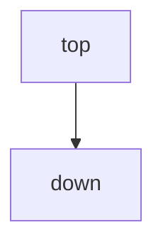
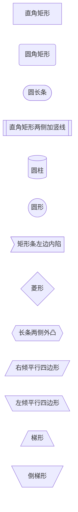
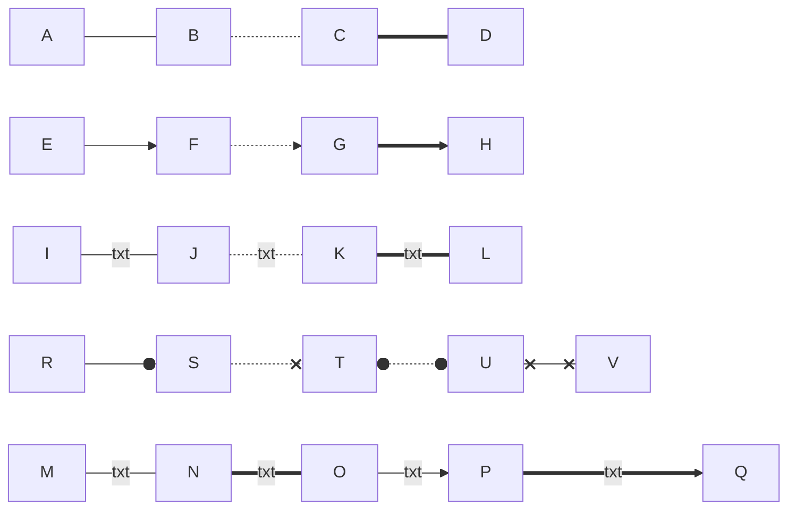
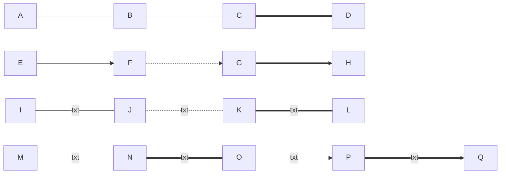
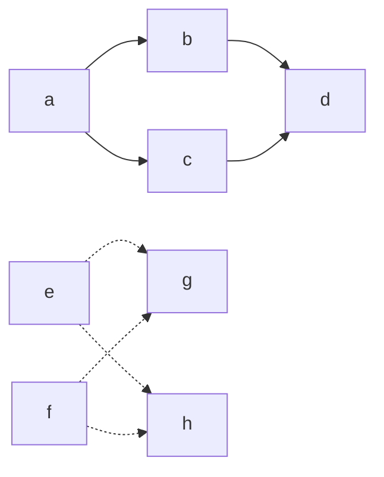
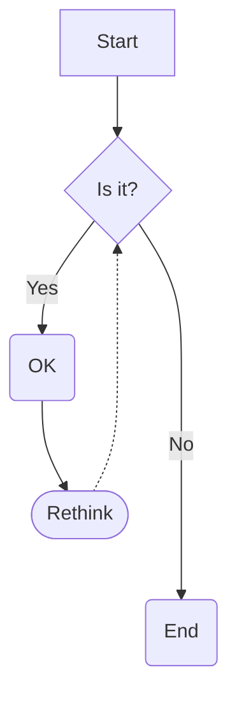
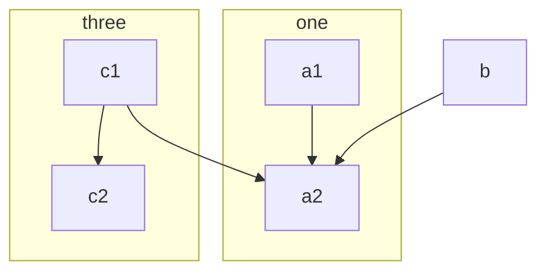

```mermaid
flowchart TD
	top --> down
```

```mermaid
flowchart LR
	left --> right
```

更多指向
+ TB/TD - top to bottom/down
+ BT - bottom to top
+ RL - right to left
+ LR - left to right

节点形状修饰

```mermaid
flowchart LR
	a[直角矩形]
	b(圆角矩形)
	c([圆长条])
	d[[直角矩形两侧加竖线]]
	e[(圆柱)]
	f((圆形))
	g>矩形条左边内陷]
	h{菱形}
	i{{长条两侧外凸}}
	j[/右倾平行四边形/]
	k[\左倾平行四边形\]
	l[/梯形\]
	m[\倒梯形/]
```

节点相连

```mermaid
flowchart LR
	A---B-.-C===D
	E-->F-.->G==>H
	I--txt---J-.txt.-K==txt===L
	M---|txt|N===|txt|O-->|txt|P===>|txt|Q
	R --o S -.-x T o-.-o U x--x V
```
增加1到2个点号/减号/等号，可以增加长度

```mermaid
flowchart LR
	A-----B-...-C=====D
	E---->F-...->G====>H
	I--txt-----J-.txt...-K==txt=====L
	M-----|txt|N=====|txt|O---->|txt|P=====>|txt|Q
```

多节点相连

```mermaid
flowchart LR
	a --> b & c -->d
	e & f -.-> g & h
```

流程图示例

```mermaid
flowchart TB
	A[Start] --> B{Is it?}
	B -- Yes --> C(OK)
	C --> D([Rethink])
	D -.-> B
	B -- No ----> E(End)
```

嵌套子图

```mermaid
flowchart TB
	c1-->a2
	subgraph one
	a1-->a2
	end
	b-->a2
	subgraph three
	c1-->c2
	end
```
