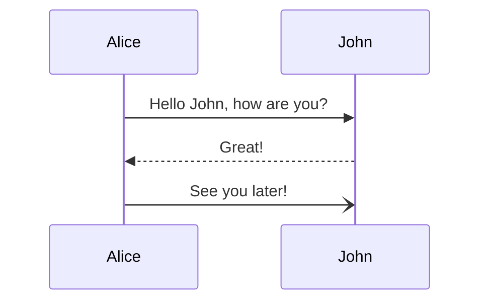
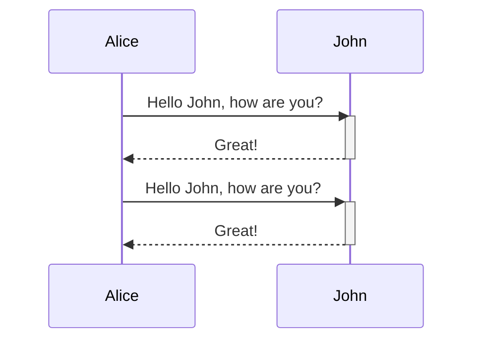
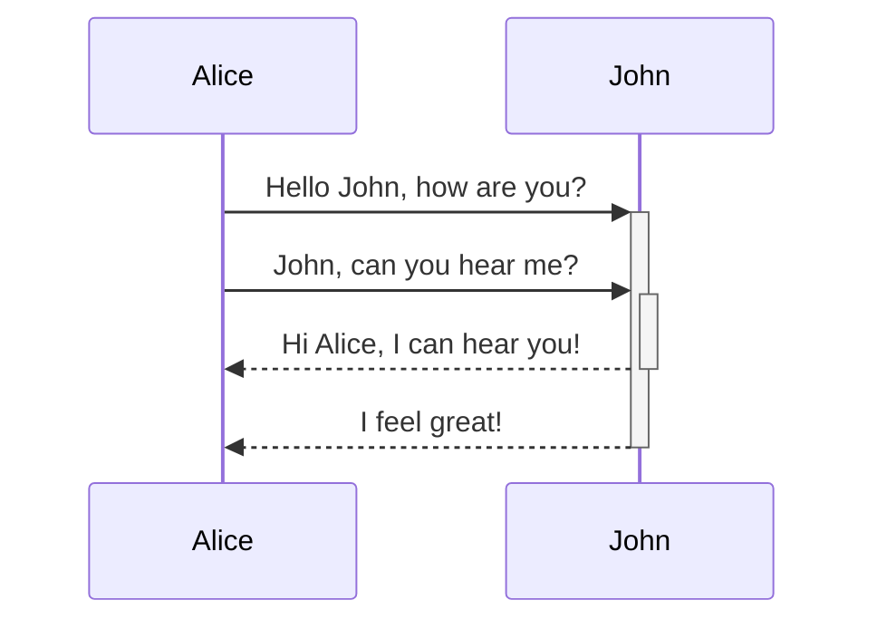
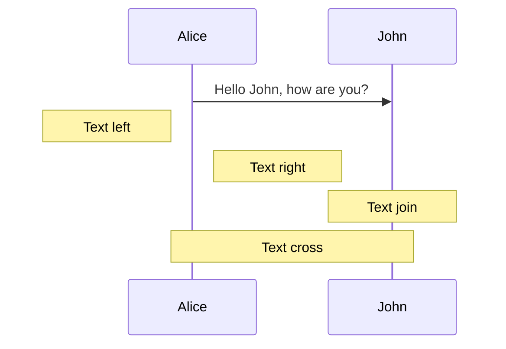
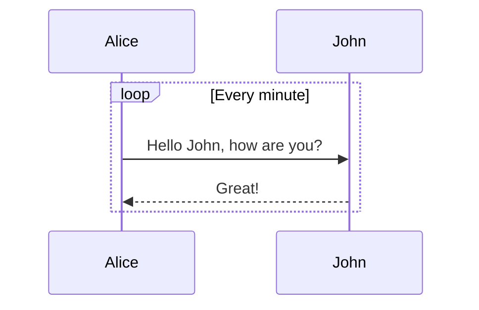
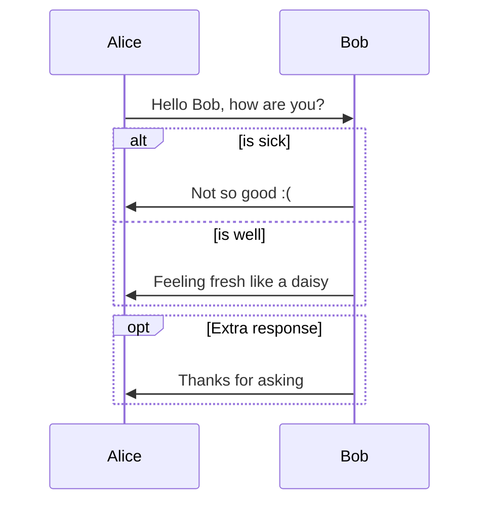
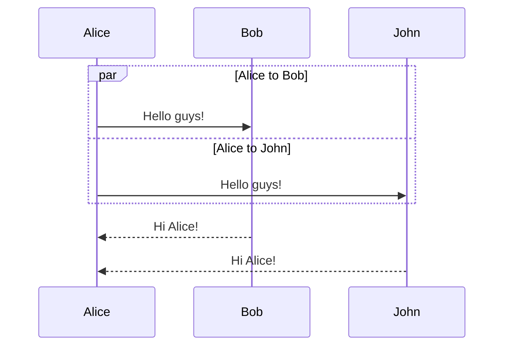
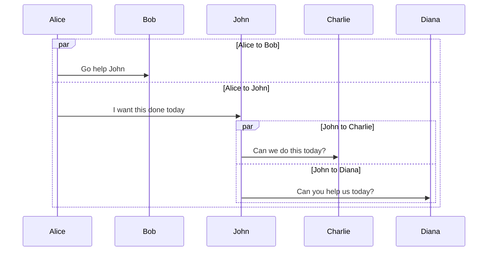
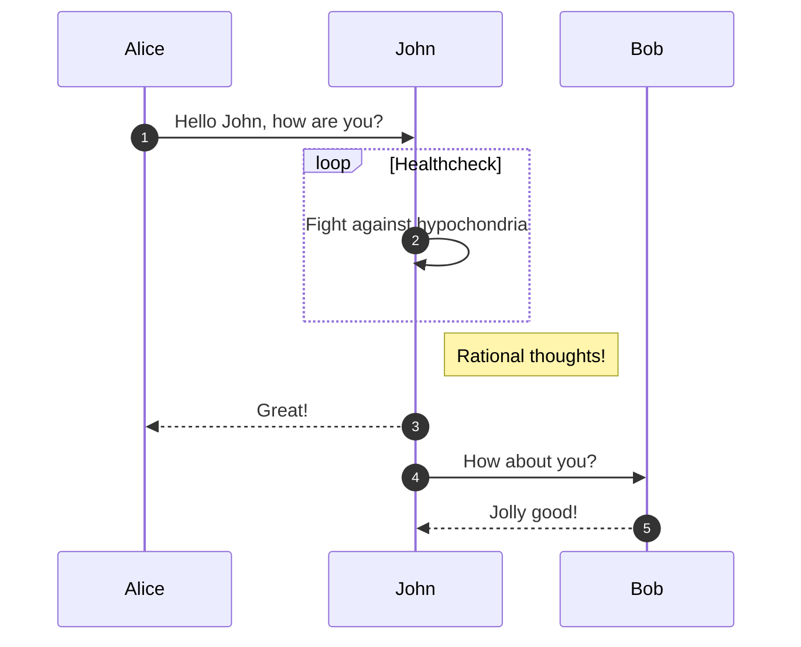

支持的箭头
-> 		Solid line without arrow
--> 	Dotted line without arrow
->>		Solid line with arrowhead
-->>	Dotted line with arrowhead
-x		Solid line with a cross at the end
--x		Dotted line with a cross at the end.
-)		Solid line with an open arrow at the end (async)
--)		Dotted line with a open arrow at the end (async)

Participants （可使用别名as）

关联 （可使用+/-号简化）

可叠加

边注 （可跨越）

块：

序号：

